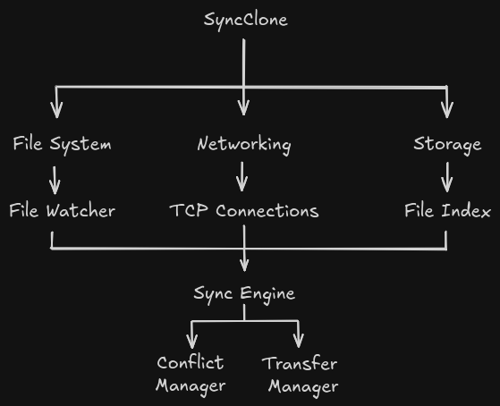

# Plan
This .md file is for detailing and documenting project outlines before actually starting work on the project itself.

### Initial Scope:
- Supports 2 Devices
- One Synchronized Folder
- Local network support only
- TCP Communication
- CRUD Files
- File transfers
- File Metadata
- Local file index
- Conflict detection

### Rough Architecture:

### What I will learn / need to research:
- Java NIO
- File systems
- Networking
- TCP/IP
- Concurrency
- Hashing
- Serialization
- Indexing
- File synchronization
- Conflict resolution

### Project Order / Roadmap
#### 1. Project Setup
- Initialize the Maven project
- Set up the basic package structure
- Create the main entry point
- Set up Git and a basic README

#### 2. File Scanner
- Read a directory recursively
- Find all files
- Collect basic file information
- Detect added, modified and deleted files

#### 3. File Hashing
- Calculate SHA-256 hashes
- Hash files to identify their contents
- Test hashing with different files

#### 4. File Metadata
- Create a `FileInfo` / `FileMetadata` class
- Store:
    - File path
    - File size
    - Modification time
    - Hash

#### 5. Local File Index
- Store the current state of all files
- Compare the index with a new scan
- Detect changes

#### 6. Filesystem Watcher
- Use Java `WatchService`
- Detect file changes while the program is running
- Update the local index when changes occur

#### 7. Basic Networking
- Create a TCP server
- Create a TCP client
- Connect two instances of JavaSync
- Send and receive basic messages

#### 8. File Transfer
- Send file metadata between peers
- Transfer files over TCP
- Save received files
- Verify the received file using its hash

#### 9. Sync Protocol
- Define a simple message format
- Exchange file indexes between peers
- Compare the indexes
- Determine which files need to be transferred

#### 10. Basic Synchronization
- Upload changed files to another peer
- Download changed files from another peer
- Create new files on the other peer
- Update modified files

#### 11. Deletion Handling
- Detect deleted files
- Inform the other peer about deletions
- Delete the corresponding file on the other peer

#### 12. Conflict Handling
- Detect when both peers modified the same file
- Prevent one peer from silently overwriting the other
- Rename/store the conflicting file

#### 13. Reliability
- Handle connection failures
- Handle interrupted file transfers
- Validate files after transfer
- Retry failed transfers

#### 14. Basic Multi-Peer Sync
- Allow more than two peers
- Keep track of connected peers
- Synchronize files between multiple peers
